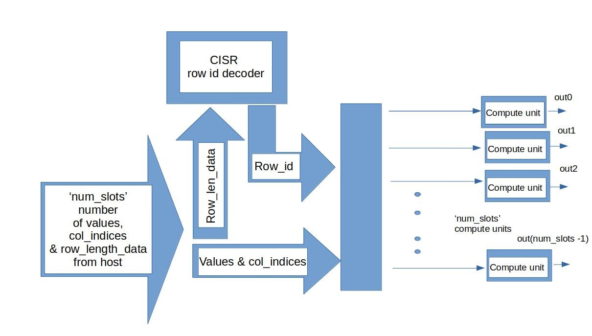

## CISR Encoding Based Runtime SPMV Accelerator Version 1

### Working
The basic outline of version 1 of the CISR encoding based runtime spmv accelerator is given as follows:
There are 'num\_slots number of compute units- made of basically a floating point multiplier and fp adder. Each slot is concerned with doing the computation on separate rows fully before moving on. As mentioned in the README of CISR based encoding, the whole logic behind CISR encoding is to make the scheduling easier. The sparse matrix data is organized in conseucitve sets of 'num\_slots' non-zero values and these are the first non-zero values for every row corresponding to different slots. So, the final idea is to push 'num\_slots' number of values to 'num\_slots' compute units so that they can easily do the computation in parallel without worrying about conflicts. Then, the next set of non-zero values for every row and different slots is pushed and so on. What we have also seen is that for each of these values pushed, it comes along with it's corresponding 'col\_index' in the matrix. So, we only have to worry about the row index decoding now. 
#### How is row index decoding done?-
We first need to know about Row length array- As we already know from the basic working, all slots will get different rows until they exhaust all rows in the matrix. So, this means every slot is concerned with a certain number of non-zero values in its mapped row. This data is also stored in the CISR encoded data for the input matrix- in the form of row length array and it's size is essentially = total number of rows in the matrix. The important thing here is that whenever a new row is mapped to a slot, a 'max\_row\_id' variable is incremented to signify the latest row id currently being worked on, and ofcourse the slot will capture the old 'max\_row\_id' - which is the row id of the new row mapped to it. This way the row id can be decoded for a slot. 
#### What is the point of number of nonzero vals in each row?
As we already know each slot will be working on its mapped row. It obviously needs to know how long it needs to be doing this- and this is essentially for 'num\_non\_zero' number of values in that row.

#### Version specific design details 
An important point to note is that this architecture has the compute units accepting 'num\_slots' number of values once, computing them and giving the result. Similarly each slot will take in it's 'row\_len\_arr' data which is number of nonzero values to the row it is or will be mapped to. All this is just one iteration ( for 'num\_slots' number of values to be pushed), and the host/ testbench will repeatedly call this accelerator function many times to finish the full computation

#### The modules or functions of the accelerator:
1. Initialize:  This is initially called once before the start of the computation, it basically initializes various arrays and pointers/ids to arrays:
a) slot\_res\_arr - For each slot it has to have a register to store accumulated values
b) row\_len\_slot\_arr - Each slot needs to have its row\_len\_arr data - ie, number of non-zero values in different rows that the slot is mapped to do. There are various pointers to this that are also initialized like- slot\_counter and slot\_row\_len\_id, etc. which are concerned with decoding/storing the row\_len\_arr data to different slots.
c) slot\_row\_counter- Each slot needs to be aware of how many non-zero values left to 'MAC' and this counter is used in that regard.
d) slot\_row\_id- Each slot works on a current row and needs to know its current row\_id.

2. Store\_row\_len\_arr:  As the name suggests, this module is responsible to push the different 'row\_len\_arr' data - ie, the number of non-zero values in different rows mapped to a slot into an array for every slot('row\_len\_slot\_arr'). This is done until we exhaust total number of rows in original matrix.

3.  CISR\_decoder: This is responsible to perform row\_id decoding whenever a slot is mapped to a new row (ie, when its done with its old row). It essentially goes through all the slots sequentially, checks if the slot is done with its particular row or not, if it is done then a new row can be taken up for it. So, now it looks into 'row\_len\_slot\_arr' and says to the slot it has to work on these many non-zero values for this new row and also gives that slot its new row\_id. We have already seen how it gives the new row\_id - essentially using a 'max\_row\_id' variable which acts like a global variable to see the latest row being worked on currently. This whole process is done for every slot.

4. Compute: This is the most basic module. It is simply concerned with doing the appropriate fp multiply and accumulate for the matrix value and the right input vector value looking at the col\_id and row\_id (decoded) and stores into a slot\_res\_arr (for different slots). After this, the  slot\_row\_counter is decremented to signify it has done 1 MAC operation.

5. Output\_write: This module simply deals with writing the slot\_res\_arr into the output\_vec regularly with every iteration. After all iterations output\_vec will have the right result values for the SPMV.
 

## Design Solutions
Given below is a summary table of different solutions explored with the same code, by varying - the number of "HLS unroll" pragmas in different modules, the maximum Tclk allowed, number of slots.
| Solution no. |              |     |      |      |                                                                                                              |           |                  |                |
|--------------|--------------|-----|------|------|--------------------------------------------------------------------------------------------------------------|-----------|------------------|----------------|
|              | Latency (ns) | DSP | FF   | LUT  | Description ( Initialize module- no unroll)                                                                  | Num slots | Target Tclk (ns) | Verified cosim |
| 1            | 310          | 5   | 1323 | 2010 | Store row_len_arr,compute,output_write- unroll and CISR decode- pipeline                                     | 4         | 10               | yes            |
| 2            | 330          | 5   | 1330 | 1889 | Only compute and output_write have unroll pragmas(Store row_len_arr, CISR decode is pipelined automatically) | 4         | 10               | yes            |
| 6            | 290          | 5   | 1713 | 2355 | Store row_len_arr,compute,output_write  and CISR decode-- unroll                                             | 4         | 10               | yes            |
| 4            | 270          | 5   | 936  | 1627 | Only compute and output_write have unroll pragmas(Store row_len_arr, CISR decode is pipelined automatically) | 2         | 10               | yes            |
| 5            | 230          | 5   | 1125 | 1634 | Store row_len_arr,compute,output_write  and CISR decode-- unroll                                             | 2         | 10               | yes            |

Note- DSP slices in all cases are- 5 = ( 2 fadd 3 fmul)\
Latency provided here is the max latency of the hardware upon one function call/ transaction in an iteration from testbench or host.\
Solutions 3,4,5 and 1,2, 6 are separately pareto optimal wrt Latency vs FF usage vs LUT usage
# Design Descriptions and Pareto-optimality
We vary the presence or absence of pragmas like- HLS unroll and HLS PIPELINE in the four main functions/modules and see how our solution's performance and resource usage estimates vary. 
Note- It is observed that a loop / function with no pragma is automatically pipelined with some initiation interval.
### Num_slots 4
1. Solution 1: We add the HLS unroll pragma to Store\_len\_arr , compute and output\_write modules and the PIPELINE pragma to CISR decode function. We can straight away notice that in the compute and output\_write funcitons there are no condiional executions inside the loop. So, different iterations of the loop in these cases get executed as much as possible in parallel subject to resource constraints (there is only 1 adder and 1 multiplier in the compute module and hardware for writing to output vector are pipelined with II = 1 cycle). The CISR decode function has an if statement in it- so it was a good idea to use HLS pipeline instead of HLS unroll to blindly produce more hardware. It made the loop II=1 cycle with a lot of writes and reads done in parallel except for updating 'row\_len_slot\_arr' which was done sequentiall.  Lastly, in the   Store\_len\_arr module, adding an HLS unroll was a bad idea with an if condition in the loop since, from observation it had produced more hardware each of which did only one iteration one after the other- hence, reducing the Hardware utilization as well. Since we unrolled so many loops, we reduced the cycles reserved as "checkpoints" in between the loops (signified by "br\_<line\_number>" in HLS) and total latency also reduces. However, the amount of LUTs increase a lot since we have tried to unroll a lot of modules.
2. Solution 2: Here, we added the unroll only in compute and output\_write modules as needed because it didnt have any if condition in it. The other modules were pipelined. This was actually a very good decision because in cases where there are if conditions in loops, it is better to use HLS PIPELINE since it tries to do a lot of processes in parallel and also try to increase the Hardware utilization efficiency. Ofcourse, here with more loops not unrolled, the "checkpoints" in between the loops (signified by "br\_<line\_number>" in HLS) increase and hence total latency also increases. However, this is probably the best solution in terms of H.U.E and relative gains in latency.
3. Solution 6: Here, we blindly add unroll everywhere which is ofcourse the worst decision. Store\_len\_arr and CISR decode modules suffer due to this. They not only have multiple hardware units working only at different clock cycles (for the different iterations) and hence increasing LUT and FF usage drastically, they also have the CISR decode operations and Store\_len\_arr operations intermixed and hence in order to do the computation right, its possible that a lot of intermediate data has to be stored in extra flip flops ( and used after many cycles), so we also see an increase in flip flop usage. However, since we have unrolled all 4 modules, the number of loop "checkpoints" go down and we see the latency coming down. 
### Num_slots 2
Please note that we can't fundamentally compare designs with num\_slots = 4 and 2 in terms of the latency provided by vivado since they have different number of channels and the total number of iterations will differ in both cases. Hence, it doesn't make sense to compare latency of the hardware which is called in a single iteration.
1. Solution 4 -Here, we added the unroll only in compute and output\_write modules as needed because it didnt have any if condition in it. This was a good decision again since HLS unroll would have blindly replicated hardware units and increased LUT and FF usage as well. However, we have quite a few number of loops and due to this there are "checkpoint" cycles for loops.
2. Solution 5 - Here, we blindly add unroll everywhere which is bad. Although lower loops reduce the number of loop "checkpoint" cycles and overall latency, there are again multiple hardware units separately performing in different cycles- which is not at all useful from a hardware utilization point of view. So, LUT and FF usage go up and again CISR decode, Store\_len\_arr operations- especially updating 'max\_row\_id' operations are intertwined and FF usage is increased.
So, here again Solution 4 is better for num\_slots = 2

