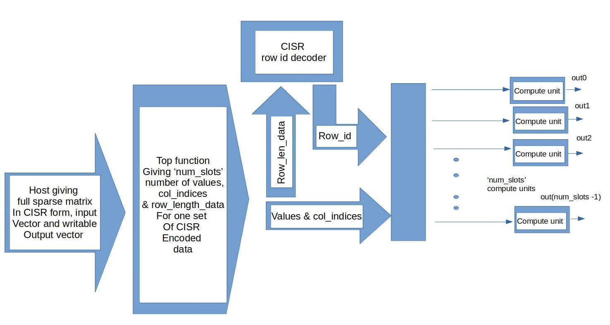

# CISR Encoding Based Runtime SPMV Accelerator Version 2

## Comparison with previous version
This version is very similar to version 1 in terms of functionality and working, but here instead of the testbench calling the hardware unit for many iterations, it calls it once- sending the input vector, sparse matrix data and output vec to be written to. This data has to be ofcourse partitioned using the HLS array_partition pragma due to less memory ports in the Zybo Z7 20 device. Then, the hardware unit is responsible for doing the entire computation. 
## Description of modules or functions of the accelerator:
So, we plan to separate out the full working of the accelerator into two components- pushing slot specific data into slot-fifos and the compute part for all the fifos.
After partitioning input data given from the testbench, two main functions are called in a for loop within the "top function". This loop basically pushes "num\_slots" amount of slot\_data and row\_length values into compute units which then perform the computation in one iteration. So, we repeat this until all non-zero values are exhausted in the CISR data. The two functions are as shown below:
1. Fifo\_push: This essentially pushes the slot\_data values ( ie, the non-zero matrix vals) and their col indices to slot\_data\_arr\_value and slot\_data\_arr\_col\_index fifos for all slots. These have their fifo depth specified by "FIFO\_DEPTH" parameter. These have to basically be pushed in every iteration (one iter= traversing num\_slots number of non-zero values in the CISR data) to all compute units. After this, again on every iteration, the row\_len\_arr data (which correspond to number of non-zero values to rows mapped to different slots) specific to slots is also pushed into a  row\_len\_slot\_arr fifo which has a depth of approximately the number of rows per slot/channel. However, this is done only up until we exhaust the number of rows in the sparse matrix which is often done before we exhaust the number of non-zero values. Beyond this point we shouldn't write into the row\_len\_slot\_arr fifo.  
2. Full\_compute: One thing to note here which is different and somewhat of an improvement over the previous version is that- a lot of the intermediate variables/arrays like- slot\_row\_counter (has number of remaining non-zero values left to compute in given row ),max\_row\_id ( global max row id being worked on) and slot\_res\_arr (accumulator regs for different compute units) are all statically initialized to 0. This saves time instead of calling a separate initialize module. Full\_compute consists of three sub-modules:

	- CISR\_decoder: This is again similar to version 1's implementation. Here, we read non-zero row-lengths from the row\_len\_slot\_arr fifo whenever a slot is done with its row (ie, when slot\_row\_counter hits zero) and it gets a new row\_id (calculated with the help of max\_row\_id) and is reassigned slot\_row\_counter with the value read from the row\_len\_slot\_arr fifo (basically number of non-zeros in new row assigned). It also r e-initializes the slot-specific accumulator registers.

	- Compute: This is again very straightforward and similar to the previous version. It essentially reads from the slot\_data\_arr\_value and slot\_data\_arr\_col\_index fifos to get the sparse matrix value and it's col\_index. After this, a simple fp-MAC operation is done with the corresponding inp\_vec value. row\_index for the slot had already been decoded by the CISR\_decoder.
	- Output\_write: This module simply writes into the output\_vec after the previous compute module is done using the row\_index decoded for the slot (row\_index for matrix is the index for the output\_vec).

Note- For better context for the above description please refer the README of version 1

## Working and software pipelining
So, now that we have identified two separate operations- fifo\_push and full\_compute and the only dependency between them being that- the first one writes into specific fifos and the second one simply reads these fifos (often based on some conditions) and does it's computation, we clearly see a "dataflow" pattern in terms of the dependencies and hence find it suitable to use the HLS dataflow pragma in the loop inside the top function. We additionally use the HLS pipeline pragma under both functions but specifically also give an initiation interval for the full\_compute function. This way we get a good amount of software pipelining with the two functions and also enable more freqeuent function calls with a given initiation interval, hence reducing the total overall latency of the top function.
Specifically here, the scenario for all the three design solutions (as seen later) is that the fifo\_push takes barely 1 or 2 cycles since its a trivial shift register based task. However, full\_compute takes a lot more number of cycles (ranging from 10-20) mainly because it involves floating point computations which take long and also it involves a lot of submodules with dependencies- CISR\_decode, compute etc. So, what we observe due to this is that the slot\_data\_arr\_value and slot\_data\_arr\_col\_index fifos (having data pushed to compute units) reach a maximum depth of 1- which is why we have set the "FIFO\_DEPTH" param as 1. The row\_len\_slot\_arr fifo is set to a depth of rows per slot/channel which is fixed beforehand unlike the former.
So, finally, fifo push of another iteration and the full\_compute of the current iteration can happen in parallel for a while (because full\_compute takes way longer time) using software pipelining, but the real performance boost seen in this version compared to the previous one is due to the effective pipelining (in terms of II) and the max latency of the full\_compute module done by vivado. Due to the HLS pipeline pragma in the full\_compute module, it completely took care of pipelining across all its submodules and obviously took into account of multiple calls to the full\_compute module which is why we get a good enough II for this module (lower than max latency).
One final thing to add is that fifos could prove to be useful in cases where we have integer operations instead of floating point where the II for full\_compute can reduce and maybe it's latency is closer to that of fifo\_push too.
## Design Solutions
Given below is a summary table of different solutions explored with the same code, by varying  the number of slots, II in the HLS pipeline pragma under full\_compute.
| Solution no. | Latency (ns) | DSP | FF   | LUT  | Description ( FIFO depth param 1 for all) | Target Tclk (ns) | Verified cosim |
|--------------|--------------|-----|------|------|-------------------------------------------|------------------|----------------|
| 1            | 500          | 10  | 3825 | 6259 | num_slots = 4 and II in full compute=10   | 10               | yes            |
| 2            | 790          | 5   | 2010 | 3229 | num_slots = 2  and II in full compute = 9 | 10               | yes            |
| 3            | 1050         | 5   | 1238 | 1887 | num_slots =1 and II in full compute = 6   | 10               | yes            |

Note- DSP slices  5 => ( 2 for fadd 3 for fmul), so 10 => 2 fadd and 2 fmul units\
Latency provided here is the max latency of the hardware (got from synthesis) for the full compute operation.\
Solutions 1,2,3 are pareto optimal in terms of latency vs FF usage vs LUT usage.\
So, as said previously, this version takes approx. 50-100 cycles for completing the full computation whereas the previous version took ~ 30 cycles to do the computation under one iteration alone (same Target Tclk). So, this version gives a significant performance boost.
## Design Descriptions and Pareto-optimality
We vary the number of slots, II in the HLS pipeline pragma under full\_compute and generate different solutions:
Note- As said before, fifo push of another iteration and the full\_compute of the current iteration can happen in parallel for only a short while (because full\_compute takes way longer time ) for all solutions. 
Here, each 'cycle' is 10ns (Target Tclk) itself.

a) Solution 1 - 'num\_slots' is 4 here and total number of iterations in top function is 4 (total non-zero values being 16). According to the synthesis report, full\_compute has a latency of 16 and II=10 cycles. Fifo\_push has latency and II of 1 cycle. Since full\_compute dominates the total time taken, we can approximately say that full\_compute starts at cycle numbers: 1,11,21 and finally 31 . The last instance has a latency of around 16 cycles which gives a total latency of 47 cycles - close to that given by the synthesis report. We have num\_slots = 4 here so the two modules-ie, full\_compute and fifo\_push will have more fifos, LUTs  and FFs due to more parallel units needed and hence the big FF and LUT usage.

b) Solution 2 - 'num\_slots' is 2 here and total number of iterations in top function is 8. According to the synthesis report, full\_compute has a latency of 12 and II=9 cycles. Fifo\_push has latency and II of 1 cycle. Since full\_compute dominates the total time taken, we can approximately say that full\_compute starts at cycle numbers: 1,10,19,28,37,46,55 and finally 64 . The last instance has a latency of around 12 cycles which gives a total latency of 76 cycles - close to that given by the synthesis report. Since the full\_compute module here is somewhat poorly pipelined (II=9 cycles with total latency being 12), it has a larger total latency time. Since the number of slots is 2 here, the amount of parallel hardware and fifos in full\_compute and fifo\_push will be lower hence reducing LUT and FF usage compared to the previous case.

c) Solution 3 - 'num\_slots' is 1 here and total number of iterations in top function is 16. According to the synthesis report, full\_compute has a latency of 11 and II=6 cycles. Fifo\_push has latency and II of 1 cycle. Since full\_compute dominates the total time taken, we can approximately say that full\_compute starts at cycle numbers: 1,7,13,19,25,31,37,43, 49,55,61,67,73,79,85 and finally 91 . The last instance has a latency of around 11 cycles which gives a total latency of 102 cycles - close to that given by the synthesis report. The full\_compute unit is well pipelined, but we need to go over many iterations. So, overall it takes around 100 cycles to finish the computation. Since the number of slots is 1 here, the amount of parallel hardware and fifos in full\_compute and fifo\_push will be extremely low hence reducing LUT and FF usage a lot. Note that even this is better than the num\_slots = 4 case of the previous version which took around 30 cycles per iteration (so 120 overall) and with lower hardware also.
